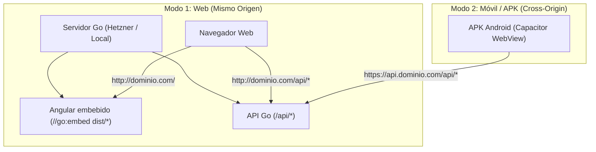

# Arquitectura de Entornos, CORS y Compilación a APK (Android)

Este documento detalla cómo interactúan el frontend (Angular), el backend (Go) embebido como binario único y la versión móvil (APK con Capacitor).

---

## 1. Arquitectura de Despliegue: Web vs Móvil



---

## 2. Estrategia de Entornos (`environments` en Angular)

Debido a que en la versión Web el backend y el frontend residen en el mismo origen, mientras que en el APK las peticiones son remotas, se definen los siguientes entornos:

### 2.1 Archivos de configuración
Se generan mediante `pnpm ng generate environments` dentro de `frontend/`:

1. **`src/environments/environment.development.ts`** (Desarrollo web en PC):
   ```typescript
   export const environment = {
     production: false,
     apiUrl: '/api', // Utiliza el proxy.conf.json hacia http://localhost:8080
   };
   ```

2. **`src/environments/environment.ts`** (Producción Web - Binario embebido en Go):
   ```typescript
   export const environment = {
     production: true,
     apiUrl: '/api', // Como Go sirve ambos en el mismo dominio, '/api' funciona directamente
   };
   ```

3. **`src/environments/environment.mobile.ts`** (Compilación para APK Android):
   ```typescript
   export const environment = {
     production: true,
     apiUrl: 'https://api.tu-servidor.com/api', // O IP local 'http://192.168.1.X:8080/api' para pruebas
   };
   ```

---

## 3. Configuración del Backend en Go (CORS y Cookies)

### 3.1 Ajuste de CORS en `backend/main.go`
Dado que el APK ejecuta las peticiones desde el esquema local de Android (`http://localhost` o `capacitor://localhost`), se deben admitir estos orígenes en el middleware de CORS:

```go
r.Use(cors.Handler(cors.Options{
    AllowedOrigins: []string{
        "http://localhost:4200",     // Desarrollo web (ng serve)
        "http://localhost",          // Capacitor Android WebView
        "capacitor://localhost",     // Capacitor iOS / Android moderno
        "https://tu-dominio.com",    // Dominio de producción
    },
    AllowedMethods:   []string{"GET", "POST", "PUT", "DELETE", "OPTIONS"},
    AllowedHeaders:   []string{"Content-Type", "Authorization"},
    AllowCredentials: true,
}))
```

### 3.2 Manejo de Cookies `HttpOnly` en Móvil
El backend utiliza cookies `HttpOnly` (`access_token`, `refresh_token`). Para evitar bloqueos de cookies de terceros o restricciones de `SameSite` entre el APK y el servidor remoto, se activa el plugin nativo **`CapacitorHttp`** en `capacitor.config.ts`:

```typescript
import { CapacitorConfig } from '@capacitor/cli';

const config: CapacitorConfig = {
  appId: 'com.cassandra.app',
  appName: 'Cassandra',
  webDir: 'dist/frontend/browser',
  plugins: {
    CapacitorHttp: {
      enabled: true, // Ejecuta las peticiones a nivel nativo de Android, gestionando cookies transparentemente
    },
  },
};

export default config;
```

---

## 4. Flujo de Trabajo para Generar el APK

1. **Compilar el frontend con la configuración móvil:**
   ```bash
   cd frontend
   pnpm run build --configuration mobile
   ```

2. **Sincronizar assets con el proyecto nativo de Android:**
   ```bash
   npx cap sync
   ```

3. **Generar APK en Android Studio:**
   ```bash
   npx cap open android
   # En Android Studio: Build > Build Bundle(s) / APK(s) > Build APK(s)
   ```
