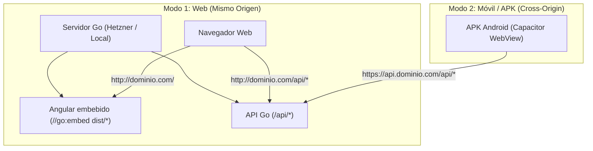

# Arquitectura de Entornos, CORS y Compilación a APK (Android)

Este documento detalla cómo interactúan el frontend (Angular), el backend (Go) embebido como binario único y la versión móvil (APK con Capacitor).

---

## 1. Arquitectura de Despliegue: Web vs Móvil


```mermaid
graph TD
    subgraph "Modo 1: Web (Mismo Origen)"
        GoServer["Servidor Go (Hetzner / Local)"]
        EmbeddedFront["Angular embebido (//go:embed dist/*)"]
        APIEndpoints["API Go (/api/*)"]
        GoServer --> EmbeddedFront
        GoServer --> APIEndpoints
        Browser["Navegador Web"] -->|http://dominio.com/| EmbeddedFront
        Browser -->|http://dominio.com/api/*| APIEndpoints
    end

    subgraph "Modo 2: Móvil / APK (Cross-Origin)"
        MobileApp["APK Android (Capacitor WebView)"]
        MobileApp -->|https://api.dominio.com/api/*| APIEndpoints
    end
```

---

## 2. Estrategia de Entornos (`environments` en Angular)

Debido a que en la versión Web el backend y el frontend residen en el mismo origen, mientras que en el APK las peticiones son remotas, se definen los siguientes entornos:

### 2.1 Archivos de configuración
Se generan mediante `pnpm ng generate environments` dentro de `frontend/`:

1. **`src/environments/environment.development.ts`** (Desarrollo web en PC):
   ```typescript
   export const environment = {
     production: false,
     apiUrl: '/api', // Utiliza el proxy.conf.json hacia http://localhost:8080
   };
   ```

2. **`src/environments/environment.ts`** (Producción Web - Binario embebido en Go):
   ```typescript
   export const environment = {
     production: true,
     apiUrl: '/api', // Como Go sirve ambos en el mismo dominio, '/api' funciona directamente
   };
   ```

3. **`src/environments/environment.mobile.ts`** (Compilación para APK Android):
   ```typescript
   export const environment = {
     production: true,
     apiUrl: 'https://api.tu-servidor.com/api', // O IP local 'http://192.168.1.X:8080/api' para pruebas
   };
   ```

---

## 3. Configuración del Backend en Go (CORS y Cookies)

### 3.1 Ajuste de CORS en `backend/main.go`
Dado que el APK ejecuta las peticiones desde el esquema local de Android (`http://localhost` o `capacitor://localhost`), se deben admitir estos orígenes en el middleware de CORS:

```go
r.Use(cors.Handler(cors.Options{
    AllowedOrigins: []string{
        "http://localhost:4200",     // Desarrollo web (ng serve)
        "http://localhost",          // Capacitor Android WebView
        "capacitor://localhost",     // Capacitor iOS / Android moderno
        "https://tu-dominio.com",    // Dominio de producción
    },
    AllowedMethods:   []string{"GET", "POST", "PUT", "DELETE", "OPTIONS"},
    AllowedHeaders:   []string{"Content-Type", "Authorization"},
    AllowCredentials: true,
}))
```

### 3.2 Manejo de Cookies `HttpOnly` en Móvil
El backend utiliza cookies `HttpOnly` (`access_token`, `refresh_token`). Para evitar bloqueos de cookies de terceros o restricciones de `SameSite` entre el APK y el servidor remoto, se activa el plugin nativo **`CapacitorHttp`** en `capacitor.config.ts`:

```typescript
import { CapacitorConfig } from '@capacitor/cli';

const config: CapacitorConfig = {
  appId: 'com.cassandra.app',
  appName: 'Cassandra',
  webDir: 'dist/frontend/browser',
  plugins: {
    CapacitorHttp: {
      enabled: true, // Ejecuta las peticiones a nivel nativo de Android, gestionando cookies transparentemente
    },
  },
};

export default config;
```

---

## 4. Flujo de Trabajo para Generar el APK

1. **Compilar el frontend con la configuración móvil:**
   ```bash
   cd frontend
   pnpm run build --configuration mobile
   ```

2. **Sincronizar assets con el proyecto nativo de Android:**
   ```bash
   npx cap sync
   ```

3. **Generar APK en Android Studio:**
   ```bash
   npx cap open android
   # En Android Studio: Build > Build Bundle(s) / APK(s) > Build APK(s)
   ```

## 5. Descarga e instalación de actualizaciones

El botón de actualizaciones consulta la última release de GitHub y busca el asset
`cassandra.apk`. En Android, `AppUpdateService` llama al plugin local
`ApkUpdaterPlugin`, registrado en `MainActivity`, en lugar de abrir el APK en Brave
u otro navegador.

El plugin usa `DownloadManager` para descargar en el directorio externo privado
de Cassandra (`Download/`). No requiere permisos generales de almacenamiento.
Guarda el identificador de descarga y el nombre del archivo en preferencias para
recuperar el estado al volver a abrir la app. El menú muestra el porcentaje, las
pausas y el botón **Instalar actualización**; los fallos se notifican y permiten
volver a descargar. Al finalizar, valida que el archivo sea un APK de Cassandra
con un código de versión superior al instalado.

La instalación comparte el APK mediante `FileProvider`. En Android 8 o superior,
si falta autorización para instalar desde Cassandra, abre los ajustes de esa
autorización. El usuario debe habilitarla, volver a la app y pulsar de nuevo
**Instalar actualización**. Android muestra su confirmación de instalación y
verifica la firma: las actualizaciones deben conservar la misma keystore de release.
La descarga anterior se elimina cuando comienza otra, y el archivo usado para
actualizar se limpia al abrir la app una vez instalada la nueva versión.

La web y las releases que todavía no tienen un APK conservan la navegación a la
URL de descarga o a la página de la release, respectivamente. El plugin solo
acepta URLs HTTPS de los APK publicados en las releases de `soteiro/cassandra`.

Para probar una actualización completa en Android, instalar primero un APK firmado
con este flujo y un código de versión inferior al de la release siguiente. Revisar
descarga, pausa por desconexión, cierre y reapertura, archivo eliminado, falta de
espacio, autorización de instalación y cancelación del instalador. La primera
actualización que incorpora este flujo se instala manualmente desde el navegador.
